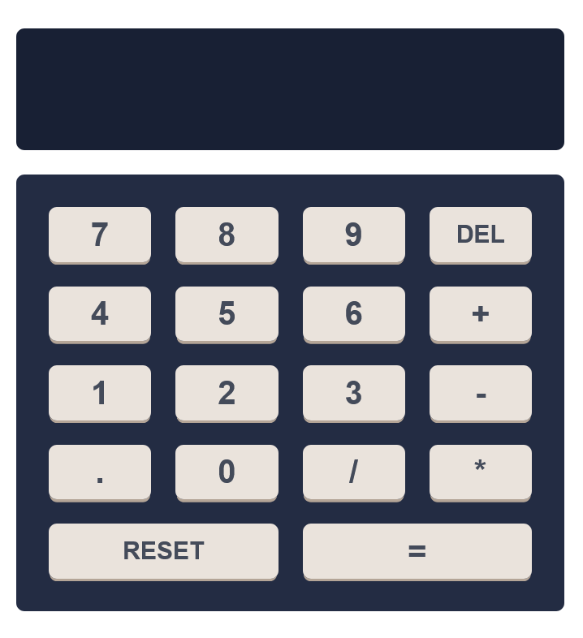

# React Project - Math Magician

This is a simple calculator app built with React.js framework and TypeScript programming Language. this calculator application is able to preform some basic Mathematical operations. To preform the mathematical I have used the tired party library called Big.js.

## Table of contents

- [Overview](#overview)
  - [The challenge](#the-challenge)
  - [Screenshot](#screenshot)
  - [Links](#links)
- [My process](#my-process)
  - [Built with](#built-with)
  - [What I learned](#what-i-learned)
  - [Continued development](#continued-development)
  - [Useful resources](#useful-resources)
- [Author](#author)
- [Acknowledgments](#acknowledgments)

## Overview

### The challenge

Users should be able to:

- View the optimal layout for each page depending on their device's screen size.
- See hover states for all interactive elements on the page.
- Preform Basic Mathematical operations.
- The project have to be built using React Components and state management.

### Screenshot

| Desktop version                              |
| -------------------------------------------- |
|  |

## My process

### Built with

- Semantic HTML5 markup
- CSS custom properties
- Flexbox
- CSS Grid
- Mobile-first workflow
- React.js framework
- TypeScript

## Author

- Frontend Mentor - [@MahdiSohaily](https://www.frontendmentor.io/profile/MahdiSohaily)
- Twitter - [@Mahdi_Rezaei_AF](https://twitter.com/Mahdi_Rezaei_AF)
- linkedIn - [@Mahdi-rezaei](https://www.linkedin.com/in/mahdi-rezaei-74705713b)
